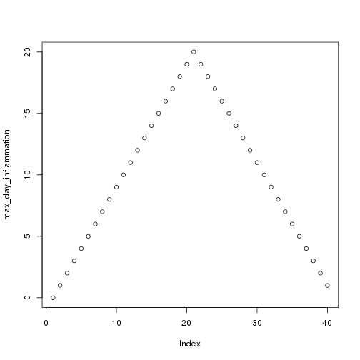

```{r setup, include=FALSE}
knitr::opts_chunk$set(echo = TRUE)
```

## Etherpad

<div class="attention">
Please do take notes on the course `etherpad`:
</div>

[http://pad.software-carpentry.org/2017-12-04-standrews](http://pad.software-carpentry.org/2017-12-04-standrews)

<div class="highlight">
* **Communal notes**: share your understanding, and benefit from others
* **Ask questions**: get detailed answers with links and examples
* **A record/reference for after the course**
</div>


## Learning Objectives

* Fundamentals of `R` and `RStudio`
* Fundamentals of programming
* Best practices for organising code
* Best practices for reproducibility
* Effective data analysis in `R`


# 01. Introduction to <br />`R` and `RStudio`


## Learning Objectives

* Understand what `R` is
* Understand what `RStudio` is
* Understand why `R` is different from something like `Excel`


## What is `R`?

* `R` is a programming language
* `R` is the software that interprets programs written in the `R` programming language

<div class="highlight">
* **Have you used `R` before?**
</div>

> * `R` is free (commercial support can be bought)
> * `R` is widely-used and *interdisciplinary* (sciences, humanities, engineering, etc.)
> * `R` has many excellent packages for statistics and data analysis, visualisation and graphics
> * `R` has an international, friendly user community

<div class="references">
<p>RStudio community support: [https://community.rstudio.com/](https://community.rstudio.com/)</p>
<p>Stack Overflow: [https://stackoverflow.com/](https://stackoverflow.com/)</p>
</div>


## "But I already know `Excel`…"

<div class="highlight">
* `Excel` is fine for many things, but `R` is great for reproducibility…
</div>

<center>

</center>

> * ***Separates data from analysis***
> * Not point-and-click: *every step is explicit and transparent*
> * Easy to share, adapt, reuse, publish analyses with new/modified data (GitHub)
> * `R` can be run on supercomputers…

    
<div class="references">
* Mike Croucher's MLPM talk: [https://mikecroucher.github.io/MLPM_talk/](https://mikecroucher.github.io/MLPM_talk/)
</div>


## What is `RStudio`?

* `RStudio` is an *integrated development environment* (IDE) - all platforms

<center>


</center>

<div class="highlight">
* Interaction with `R` (console/'scratchpad')
* Script/code editor
* Graphics/visualisation
* Project management (`git` integration)
</div>


# 02. Getting to know `RStudio`


## Learning Objectives

* Familiarity with the `RStudio` IDE
* Introduce `R` syntax
* Learn good project management practices
* Set up a working directory with version control (`git`) in `RStudio`


## `RStudio` overview - Interactive Demo

<center>

</center>

## Challenge 01 (5min)

* **Try out some of your own calculations in the interactive console**

```{r}
2 ** 16
15 %% 4
15 %/% 4
```


## Variables

<div class="highlight">
**Variables** are like *named boxes*
</div>

* An item of data goes in the box (called `Name`)
* When we refer to the box (*variable*) by its name, we really mean *what's in the box*

<center>

</center>


## Variables - Interactive Demo

```{r}
name <- "Samia"
name
x <- 1 / 40
x
x ^ 2
log(x)
```


## Functions

* Function (`log()`, `sin()` etc.) ≈ "canned script"
    * automate complicated tasks
    * make code more readable and reusable
* Some functions are built-in (in *base* packages, e.g. `sqrt()`, `lm()`, `plot()`)
* Some functions are *imported* in *libraries*

<div class="attention">
* Functions usually take *arguments* (*input*)
* Functions often *return* values (*output*)
</div>

## Getting Help For Functions

<center>
<div class="attention">
INTERACTIVE DEMO
</div>
</center>

```{r, eval=FALSE}
args(fname)            # arguments for fname
?fname                 # help page for fname
help(fname)            # help page for fname
??fname                # any mention of fname
help.search("text")    # any mention of "text"
vignette(fname)        # worked examples for fname
vignette()             # show all available vignettes
```

## Removing Variables

To remove variables from your workspace, use the `rm()` function

```{r}
x <- 1
ls()
rm(x, name)
ls()
```

To remove all variables use the broom in the `Environment` tab (`Rstudio`), or:

```{r}
rm(list=ls())
```


## Challenge 02 (5min)

What will be the value of each variable after each statement in the following program?

```{r, echo=TRUE}
mass <- 47.5
age <- 122
mass <- mass * 2.3
age <- age - 20
```

* `mass = 47.5, age = 102`
* `mass = 109.25, age = 102`
* `mass = 47.5, age = 122`
* `mass = 109.25, age = 122`


## Good Variable Names

* Descriptive (but not *too* long)
* Avoid existing names (e.g. `mean`, `matrix`, `list`, etc.)
* Consistent style
    * `periods.between.words`
    * `underscores_between_words`
    * `camelCaseToSeparateWords`

<center>
<div class="highlight">
**IN `R`…**
</div>
</center>

> * letters, numbers, underscores, and periods (`[a-zA-z0-9_.]`)
> * cannot start with a number
> * whitespace is not allowed


## Good Project Management Practices

<div class="highlight">
**No single 'right way' - only good principles**
</div>

* Use a single working directory per project/analysis
    - easier to move, share, and find files
    - use *relative paths* to locate files
* Treat raw data as read-only
    * keep in separate subfolder (`data`)?
* Clean data ready for work
    * keep cleaned/modified data in separate folder?
* Consider output generated by analysis to be disposable
    * can be regenerated by running analysis/code
    * don't place under version control

<div class="references">
Good Enough Practices in Scientific Computing (2017) Wilson *et al.* [http://journals.plos.org/ploscompbiol/article?id=10.1371/journal.pcbi.1005510](http://journals.plos.org/ploscompbiol/article?id=10.1371/journal.pcbi.1005510)
</class>

## Example Directory Structure

<center>

</center>


## Project Management in `RStudio`

* `RStudio` tries to help you manage your projects
    * `R Project` concept - files and subdirectory structure
    * `git` integration
    * switching between multiple projects within `RStudio`
    * stores project history
    
<div class="highlight">
**Let's create a project in `RStudio`**

Using `git` for version control.
</div>

<center>
<div class="attention">
**INTERACTIVE DEMO**
</div>
</center>


<div class="references">
`RStudio` projects: [https://support.rstudio.com/hc/en-us/articles/200526207-Using-Projects](https://support.rstudio.com/hc/en-us/articles/200526207-Using-Projects)
</div>


## Working in `RStudio`

<div class="highlight">
We can write code in several ways in `RStudio`
</div>

* At the console (you've done this)
* In a script
* As an interactive notebook
* As a markdown file
* As a Shiny app

We're going to create a new dataset and `R` script.

* Putting code in a script makes it easier to modify, share and run

<center>
<div class="attention">
**INTERACTIVE DEMO**
</div>
</center>


# 03. A First Analysis in `RStudio`


## Learning Objectives

* Load data into an `R` project
* Produce summary statistics of data
* Extract subsets of data
* Basic plotting in `R` (*base graphics*)


## Our Task

* Patients have been given a new treatment for arthritis
* We have measurements of inflammation over a period of days for each patient
* We want to produce a preliminary analysis and graphs for this data

<div class="highlight">
Download the file from the following link to your `data/` directory, and extract it
</div>

* [https://swcarpentry.github.io/r-novice-inflammation/files/r-novice-inflammation-data.zip](https://swcarpentry.github.io/r-novice-inflammation/files/r-novice-inflammation-data.zip)

(the link is available on the course Etherpad page)


## Loading Data - Interactive Demo

* You created data manually earlier, but this is rare
* Data are most commonly read in from plain text files

<div class="highlight">
Data files can be inspected in `RStudio`
</div>

```{r, eval=FALSE}
read.csv(file = "data/inflammation-01.csv", header = FALSE)
```


## Challenge 03 (5min)

How would you open a similar data file that had:

* a comma (`,`) as the decimal point character
* semi-colon (`;`) as the field separator

using `read.csv()`

<center>
<div class="attention">
**Use the help function and documentation**
</div>
</center>


## Indexing Data - Interactive Demo

* We use *indexing* to refer to elements of a dataset
    * square brackets: `[]`
    * row, then column: `[row, column]`

```{r, eval=FALSE}
data[1, 1]     # First value in dataset
data[30, 20]   # Middle value of dataset
```

* To get a range of values, use the `:` separator (meaning 'to')

```{r, eval=FALSE}
data[1:4, 1:4]   # rows 1 to 4; columns 1 to 4
```

* To select a complete row or column, leave it blank

```{r, eval=FALSE}
data[5, ]     # row 5
data[, 16]    # column 16
```


## Summary Functions - Interactive Demo

* `R` provides useful functions to summarise data
* We can use *indexing* to get summary information on individual patients and days

```{r, eval=FALSE}
max(data)           # largest value in dataset
max(data[2, ])      # largest value for patient 2
min(data[, 7])      # smallest value on day 7
mean(data[, 7])     # mean value on day 7
sd(data[, 7])       # standard deviation of values on day 7
```


## Challenge 04 (5min)

Given the *vector* in `R`:

```{r}
animal <- c("m", "o", "n", "k", "e", "y")
```

Can you generate slices that do the following:

* return the first three characters
* return the last three characters
* return the first three characters *in reverse order*

* What do `animal[-1]` and `animal[-4]` do?
* Can you explain what `animal[-1:-4]` does?


## Repetitive Calculations - Interactive Demo

* We could calculate mean inflammation for every patient (or day) this way, but it's tedious

<div class="highlight">
**Computers exist to do tedious things for us**
</div>

* `R` has several ways to automate this process
* We'd like to `apply` a *function* (`mean`) to each row in the `data`:

```{r, eval=FALSE}
apply(X = data, MARGIN = 1, FUN = mean)
```

<div class="attention">
* `MARGIN = 1`: rows
* `MARGIN = 2`: columns
</div>

```{r, eval=FALSE}
rowMeans(data)
colMeans(data)
```


## Base Graphics

> "The purpose of computing is insight, not numbers.” - Richard Hamming

<div class="highlight">
* `R` has many available graphics packages
    * graphically beautiful
    * specific problem domains
* 'built-in' graphics are known as *base graphics*
</div>

* Base graphics are powerful tools for visualisation and understanding


## Plotting - Interactive Demo

```{r, eval=FALSE}
plot(avg_inflammation_patient)

max_day_inflammation <- apply(dat, 2, max)
plot(max_day_inflammation)

plot(apply(dat,2,min))       # 3 functions in one!
```

<center>



</center>


## Challenge 05 (5min)

Can you add a plot to your script showing:

* standard deviation, by day
* a histogram of inflammation by day

<div class="attention">
**(don't forget to commit changes)**
</div>


# 04. Data Types and <br />Structures in `R`


## Learning Objectives

* Basic data types in `R`
* Common data structures in `R`
* How to find out the type/structure of `R` data
* Understand how `R`'s data types and structures relate to your own data


## Data Types and Structures in `R`

* `R` is mostly used for data analysis
* `R` has special *types* and *structures* to help you work with data
* Much of the focus is on tabular data (*data frames*) 

<center>
<div class="attention">
**INTERACTIVE DEMO**
</div>
</center>

<div class="highlight">
Understanding data types, their uses, and how they relate to your own data is key to successful analysis with `R`

(it's not just about programming)
</div>

## What Data Types Do You Expect?

<center>
<div class="attention">
**What data types would you expect to see?**

What examples of data types can you think of from your own experience?
</div>
</center>

## Data Types in `R`

* Data *types* in `R` are *atomic*
    * All data is one of these types
    * All data *structures* are built from these
    
<div class="highlight">
1. **logical**: `TRUE`, `FALSE`
2. **numeric**:
    * **integer**: `3`, `2L`, `123456`
    * **double** (*decimal*): `3.0`, `-23.45`, `pi`
3. **complex**: `3+0i`, `1+4i`
4. **character** (*text*): `"a"`, `'SWC'`, `"This is not a string"`
5. **raw**: binary data
</div>

<center>
<div class="attention">
**INTERACTIVE DEMO**
</div>
</center>


## Challenge 06 (5min)

Create examples of data with the following characteristics:

<div class="highlight">
* name: `answer`, type: `logical`
* name: `height`, type: `numeric`
* name: `dog_name`, type: `character`
</div>

For each variable, test that it has the data type you intended


## Five Common `R` Data Structures

* `vector`
* `factor`
* `list`
* `matrix`
* `data.frame`

<center>
<div class="attention">
**INTERACTIVE DEMO**
</div>
</center>


## Challenge 07 (5min)

Vectors are *atomic*: they can contain only a single data *type*

What data type are the following vectors (`xx`)?

```R
xx <- c(1.7, "a")
xx <- c(TRUE, 2)
xx <- c("a", TRUE)
```

<div class="highlight">
Options: `logical`, `integer`, `numeric`, `character`
</div>


## Coercion

* *Coercion* means changing data from one type to another
* `R` will perform *implicit coercion* on vectors to make them atomic

<div class="highlight">
`logical` $\rightarrow$ `integer` $\rightarrow$ `double` $\rightarrow$ `complex` $\rightarrow$ `character`
</div>

<center>
<div class="attention">
**If there are formatting problems with your data, you might not have the type you expect when you import into `R`**
</div>
</center>

* Manual coercion with `as.<type_name>()`

<center>
<div class="attention">
**INTERACTIVE DEMO**
</div>
</center>


## Factors

Data often comes in one of two types:

* *quantitative*: e.g. integers or real numbers <br />(`weight <- 17.2`; `rooms <- 7`)
* *categorical*:  e.g. ordered or unordered classes <br />(`grade <- "8"`, `coat <- "brindled"`)

<div class="highlight">
**This kind of distinction critical in many applications (e.g. statistical modelling)**
</div>

> * **Factors** are special vectors that represent *categorical* data
    * Stored as vectors of *labelled integers*
    * **Cannot be treated as strings/text**

<center>
<div class="attention">
**INTERACTIVE DEMO**
</div>
</center>


## Challenge 08 (5min)

Create a new `factor`, defining `control` and `case` experiments, and inspect the result:

```{r}
f <- factor(c("case", "control", "case", "control", "case"))
str(f)
```

<div class="attention">
**In some statistical analyses in `R` it is important that the `control` level is numbered `1`**
</div>

* Using the help available to you in `RStudio`, can you create a factor with the same values, but where the `control` level is numbered `1`?


## Matrices

* *Matrices* are arrays of numeric values
    * An extremely important data type in numerical analyses
    
<center>
<div class="attention">
**INTERACTIVE DEMO**
</div>
</center>

```{r}
# Create matrix of zeroes
m1 <- matrix(0, ncol = 6, nrow = 3)

# Create matrix of numbers 1 and 2
m2 <- matrix(c(1, 2), ncol = 4, nrow = 3)
```


## Challenge 09 (5min)

Can you create a matrix with:

* 5 columns
* 10 rows
* Containing the numbers `1:50`

<div class="highlight">
* Did the `matrix()` function fill the matrix by column, or by row?
* If the matrix was filled by row, can you create a new matrix that fills by column (or *vice versa*)

**Use the `Rstudio` documentation to help**
</div>


## Lists

* `list`s are like *vectors*, but can hold *any combination of datatype*
    * *elements* in a `list` are denoted by `[[]]` and can be named
    
<center>
<div class="attention">
**INTERACTIVE DEMO**
</div>
</center>

```{r}
# create a list
l <- list(1, 'a', TRUE, matrix(0, nrow = 2, ncol = 2), f)
l_named <- list(a = "SWC", b = 1:4)
```


# 05. Dataframes


## Learning Objectives

* Understand the concept of a `data.frame`
* Understand how a `data.frame` is built from `R` data structures
* Know how to access any element of a `data.frame`
* Read data into a `data.frame`
* Write data out from a `data.frame`


## Let's look at a `data.frame`

* The `cats` data is a `data.frame`

<center>
<div class="attention">
**INTERACTIVE DEMO**
</div>
</center>

```{r, eval=FALSE}
> class(cats)
[1] "data.frame"
> cats
    coat weight likes_string
1 calico    2.1            1
2  black    5.0            0
3  tabby    3.2            1
```

## What is a `data.frame`?

<div class="highlight">
* The standard `R` data structure for storing tabular, *rectangular* data
</div>

* A named `list` of `vector`s having identical lengths.
    * Each column is a `vector`
    * Each `vector` can be a different data type
    
<div class="attention">
* This is very much **LIKE** a spreadsheet, but…
    * Columns are constrained to a type
    * Columns are all the same length
</div>


## Creating a `data.frame`

<center>
<div class="attention">
**INTERACTIVE DEMO**
</div>
</center>

```{r}
# Create a data frame
df <- data.frame(a=c(1,2,3), b=c('eeny', 'meeny', 'miney'),
                 c=c(TRUE, FALSE, TRUE))
summary(df)
```


## Challenge 10 (5min)

I made some mistakes when defining this `data.frame`.

Can you spot and fix them?

```{r, eval=FALSE}
author_book <- data.frame(author_first = c('Charles', 'Ernst', "Theodosius"),
                          author_last = c(Darwin, Mayr, Dobzhansky),
                          year = c(1942, 1970))
```


## Challenge 11 (5min)

Can you predict the class for each column in the following example?

```{r}
country_climate <- data.frame(country=c("Canada", "Panama",
                                        "South Africa", "Australia"),
                               climate=c("cold", "hot", "temperate",
                                         "hot/temperate"),
                               temperature=c(10, 30, 18, "15"),
                               northern_hemisphere=c(TRUE, TRUE, FALSE,
                                                     "FALSE"),
                               has_kangaroo=c(FALSE, FALSE, FALSE, 1))
```


## Challenge 12 (5min)

Can you create the following data frame, but make `b` a vector of `character` elements, rather than a `factor`?

```{r}
df_chr <- data.frame(a=c(1,2,3), b=c('eeny', 'meeny', 'miney'),
                     c=c(TRUE, FALSE, TRUE))
```

<center>
<div class="attention">
**Use the `RStudio` help**
</div>
</center>


## Adding rows and columns

* We *bind* `vector`s to add columns, and `list`s to add rows
    * Adding a new `factor` level may be required

```{r}
df <- cbind(df, vals = 3:1)
levels(df$b) <- c('eeny', 'meeny', 'miney', 'mo')
df <- rbind(df, list(4, 'mo', FALSE, 0))
```

<center>
<div class="attention">
**INTERACTIVE DEMO**
</div>
</center>


## Writing `data.frame` to file

<center>
<div class="attention">
**INTERACTIVE DEMO**
</div>
</center>

```{r, eval=FALSE}
write.table(df, "data/df_example.tab", sep="\t")
```

We need to provide

* the `data.frame`
* the path to the file being written
* a column separator


## Reading into a `data.frame`

<center>
<div class="attention">
**INTERACTIVE DEMO**
</div>
</center>

<div class="highlight">
* Download data from [https://raw.githubusercontent.com/resbaz/r-novice-gapminder-files/master/data/gapminder-FiveYearData.csv](https://raw.githubusercontent.com/resbaz/r-novice-gapminder-files/master/data/gapminder-FiveYearData.csv)
* Put the file in the `data/` directory

**The link is available on the course Etherpad**
</div>

```{r, eval=FALSE}
gapminder <- read.table("data/gapminder-FiveYearData.csv", sep=",", header=TRUE)
```

* `R` can also read data direct from the internet

```{r}
url <- paste("https://raw.githubusercontent.com/resbaz/r-novice-gapminder-files/",
             "master/data/gapminder-FiveYearData.csv", sep = '')
gapminder <- read.table(url, sep=",", header=TRUE)
```